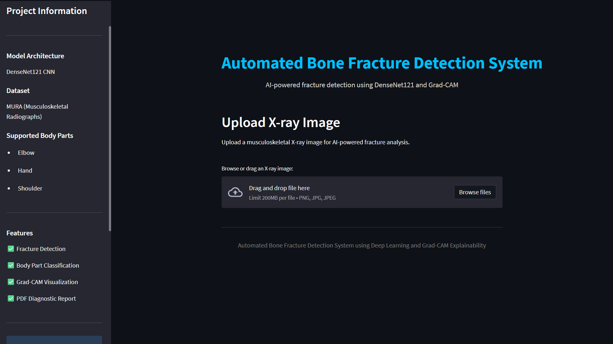
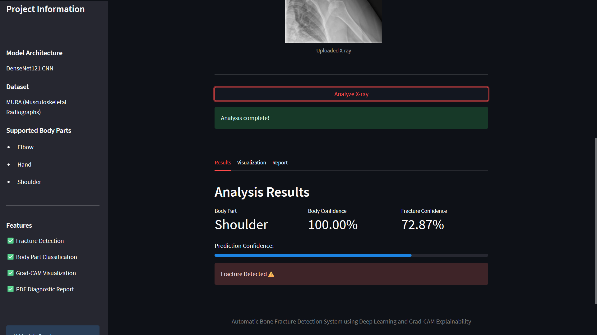
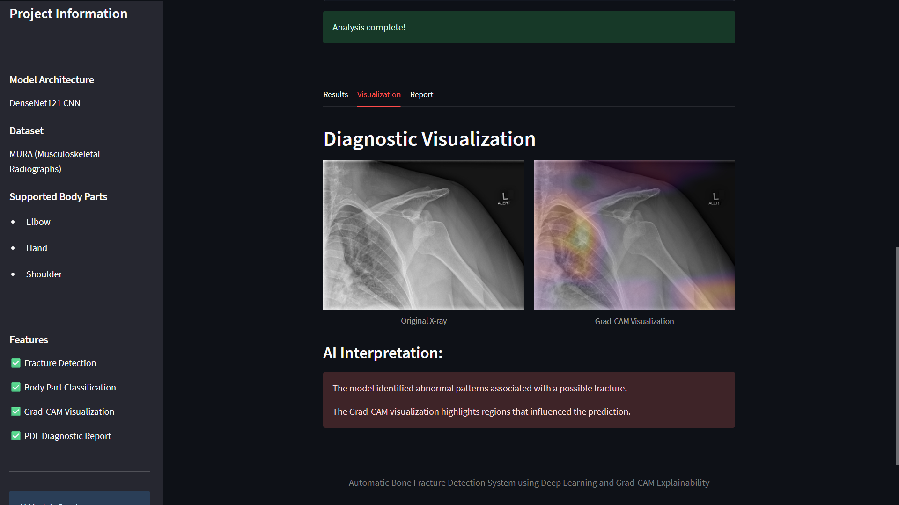
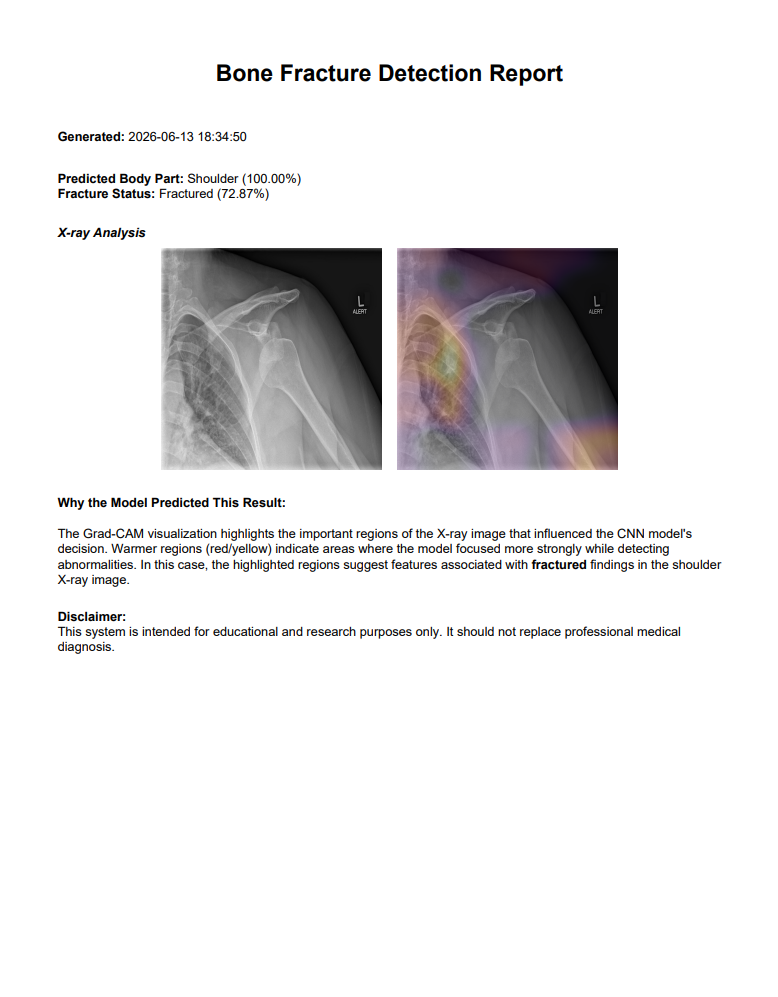

# 🦴 Automatic Bone Fracture Detection

An AI-powered Bone Fracture Detection System that automatically identifies the body part from an X-ray image and then performs fracture detection using specialized deep learning models. The system is built using DenseNet121, TensorFlow, Streamlit, and Grad-CAM to provide accurate predictions along with visual explanations.

---

## 📌 Project Overview

This project implements a two-stage deep learning pipeline for automated fracture detection from musculoskeletal X-ray images.

### Stage 1: Body Part Classification
The uploaded X-ray is classified into one of the following body parts:

- Elbow
- Hand
- Shoulder

### Stage 2: Fracture Detection
Based on the identified body part, a dedicated fracture detection model is used to determine whether the X-ray contains a fracture.

The system also generates Grad-CAM visualizations to highlight regions that influenced the model's decision and provides downloadable PDF reports.

---

## ✨ Features

- Automatic Body Part Classification
- Fracture Detection for Elbow, Hand, and Shoulder X-rays
- Confidence Score Display
- Grad-CAM Heatmap Visualization
- PDF Report Generation
- Interactive Streamlit Web Interface
- Desktop GUI Support
- Real-Time X-ray Analysis

---

## 🧠 Deep Learning Models

### Body Part Classification Model

- Architecture: DenseNet121
- Classes:
  - Elbow
  - Hand
  - Shoulder

### Fracture Detection Models

Separate DenseNet121 models were trained for:

- Elbow Fracture Detection
- Hand Fracture Detection
- Shoulder Fracture Detection

---

## 📊 Model Performance

### Body Part Classification

| Metric | Value |
|----------|----------|
| Accuracy | 99.86% |
| Macro AUC | 1.000 |

### Fracture Detection Results

| Model | Accuracy | Precision | Recall | F1-Score | AUC |
|---------|---------|---------|---------|---------|---------|
| Elbow | 87.53% | 88.05% | 86.52% | 87.30% | 0.939 |
| Hand | 85.87% | 86.47% | 77.78% | 81.90% | 0.927 |
| Shoulder | 89.05% | 87.54% | 90.44% | 88.95% | 0.948 |

---

## 📂 Project Structure

```text
Automatic-Bone-Fracture-Detection/
│
├── assets/
│   ├── logo.png
│   └── sample_xray.jpeg
│
├── core/
│   ├── config.py
│   ├── gradcam.py
│   ├── pdf_report.py
│   ├── predictions.py
│   └── preprocessing.py
│
├── desktop/
│   └── mainGUI.py
│
├── web/
│   └── app.py
│
├── weights/
│   ├── DenseNet121_BodyParts_best.keras
│   ├── DenseNet121_Elbow_best.keras
│   ├── DenseNet121_Hand_best.keras
│   └── DenseNet121_Shoulder_best.keras
│
├── training_parts.py
├── training_fracture.py
├── evaluate_models.py
├── prediction_test.py
├── requirements.txt
└── README.md
```

---

## 🗂 Dataset

This project uses the MURA (Musculoskeletal Radiographs) Dataset.

### Dataset Information

- Source: Stanford University
- Type: Musculoskeletal X-ray Images
- Categories Used:
  - Elbow
  - Hand
  - Shoulder

Dataset Link:

https://stanfordmlgroup.github.io/competitions/mura/

> Note: The dataset is not included in this repository due to size limitations.

---

## 🛠 Technologies Used

### Programming Language

- Python

### Deep Learning

- TensorFlow
- Keras
- DenseNet121

### Image Processing

- OpenCV
- NumPy
- Pillow

### Visualization

- Matplotlib
- Grad-CAM

### User Interface

- Streamlit
- Tkinter

---

## 🚀 Installation

### Clone Repository

```bash
git clone https://github.com/YOUR_USERNAME/Bone-Fracture-Detection-Using-MURA-Dataset.git

cd Automatic-Bone-Fracture-Detection
```

### Create Virtual Environment

```bash
python -m venv venv
```

### Activate Environment

Windows:

```bash
venv\Scripts\activate
```

Linux/Mac:

```bash
source venv/bin/activate
```

### Install Dependencies

```bash
pip install -r requirements.txt
```

---

## ▶️ Run Streamlit Application

```bash
streamlit run web/app.py
```

Then open:

```text
http://localhost:8501
```

---

## ▶️ Run Desktop Application

```bash
python desktop/mainGUI.py
```

---

## 🔍 How It Works

1. Upload an X-ray image.
2. The Body Part Classifier identifies the anatomical region.
3. The corresponding fracture detection model is selected.
4. Fracture prediction is generated.
5. Confidence score is displayed.
6. Grad-CAM heatmap highlights important regions.
7. PDF report can be downloaded.

---

## 📈 Future Improvements

- Support additional body parts from MURA
- Multi-fracture localization
- Object detection-based fracture identification
- Model deployment on cloud platforms
- Mobile application integration
- Explainable AI enhancements

---

## 📸 Application Screenshots

| Home Page | Prediction Result |
|------------|------------|
|  |  |

| Grad-CAM Visualization | PDF Report |
|------------|------------|
|  |  |

---

## 🎓 Academic Use

This project was developed as part of an MCA specialization in Data Science, Artificial Intelligence, and Machine Learning. It demonstrates the application of Deep Learning and Computer Vision techniques in medical image analysis and computer-aided diagnosis systems.

---

## 👨‍💻 Author

**Nimil P. Gopal**

MCA – Data Science with AI & ML

GitHub: https://github.com/NimilPGopal

LinkedIn: https://www.linkedin.com/in/nimilpgopal/

---
